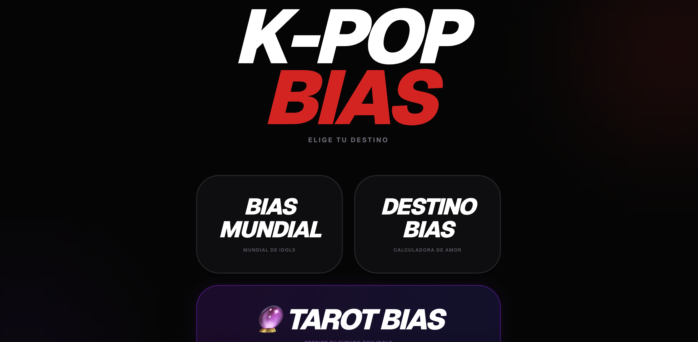
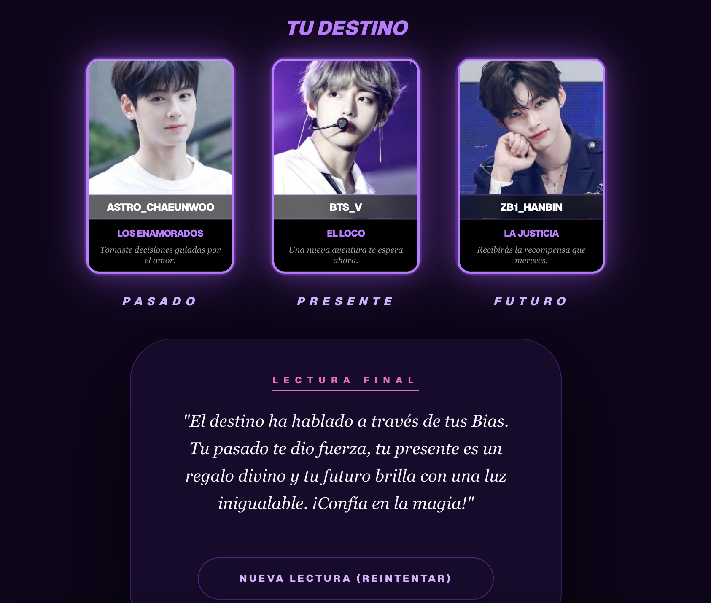

# K-POP BIAS 

https://www.kpop-bias.com/

An interactive K-POP fan entertainment platform where users can discover their favorite idols through fun experiences such as Idol World Cup, compatibility tests, and tarot readings.

Built for global K-POP fans, especially Latin American users, with a Spanish-based user interface and viral sharing features.

## Screenshots

### Home

### Idol World Cup

Choose your favorite K-POP idol through a tournament-style voting game.

### Idol Compatibility Test

Users can calculate their compatibility with their favorite idol by entering their name and birthday.

### Compatibility Result

Generates a compatibility score and allows users to share their results.

### Tarot Bias

Select three tarot cards and discover your idol-based fortune reading.

### Tarot Result

Displays the final tarot interpretation based on selected cards and idol data.

# Features

## Idol World Cup

- Tournament system with 32 / 64 / 128 / 256 rounds
- Randomized idol selection
- Final winner generation
- Social sharing functionality
- Global ranking system

## Idol Compatibility Test

- Idol search functionality
- User name and birthday input
- Compatibility score calculation
- Personalized result generation
- Share results via social media

## Tarot Bias

- 22 tarot card system
- Past / Present / Future card selection
- Idol data integration
- Animated card flip interactions

# Tech Stack

## Frontend

- Next.js 14
- React 18
- TypeScript
- Tailwind CSS
- Framer Motion

## Backend

- Supabase

## Deployment

- Vercel

# Database

Supabase is used to manage idol information and user interaction data.

Stored data includes:

- Idol names
- Korean names
- Profile images
- Ranking scores
- Tarot card mapping data

# Responsive Design

Designed with a mobile-first approach for K-POP fans who primarily access entertainment content through smartphones.

The interface is optimized for various screen sizes and touch interactions.

# Project Goal

The goal of this project was to create an engaging fan experience rather than a simple information website.

By combining interactive games, personalization, and social sharing features, the platform encourages users to participate and share their results with other fans.

# Developer

Created by Ginikang3

Built with Next.js, TypeScript, Tailwind CSS, and Supabase.